#### These procedure steps will be followed on the simulator

1. Open the Double acting reciprocating pump and click on the NEXT button shown at the bottom right corner and also description provided. 
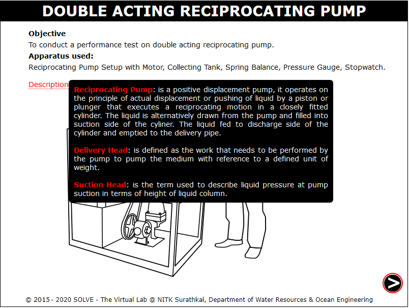 

2. Click on the green button to start the pump and click on NEXT button. 
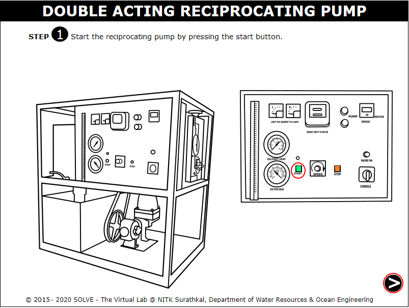 

3. Click on the hand to rotate the inlet valve and allow the water to flow. 
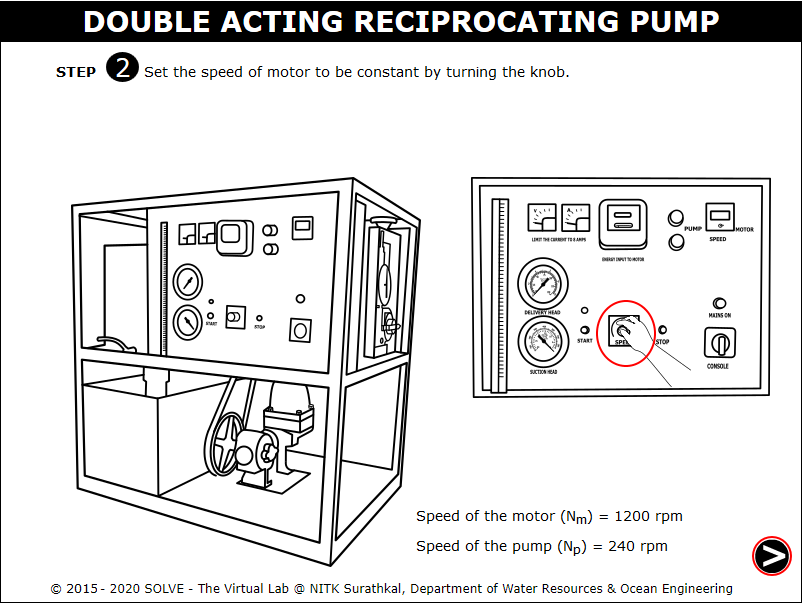 

4. Note the speed of motor as shown in the circle and click on NEXT button. 
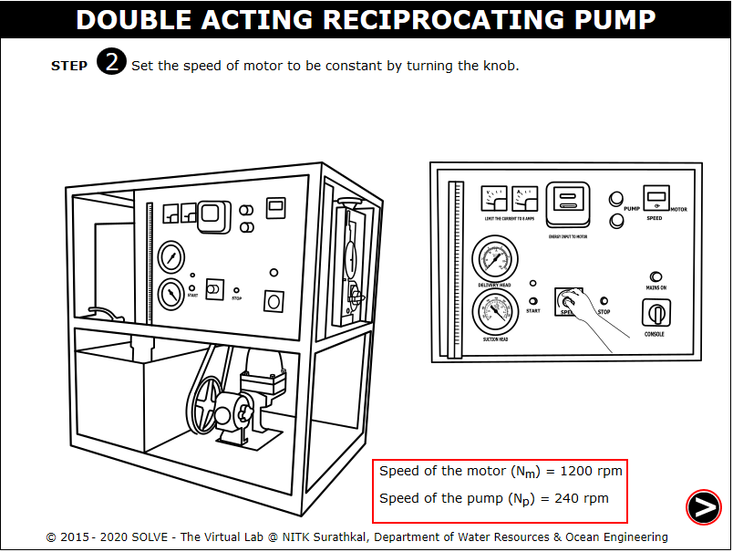 

5. Click on delivery head gauge to show the delivery head. 
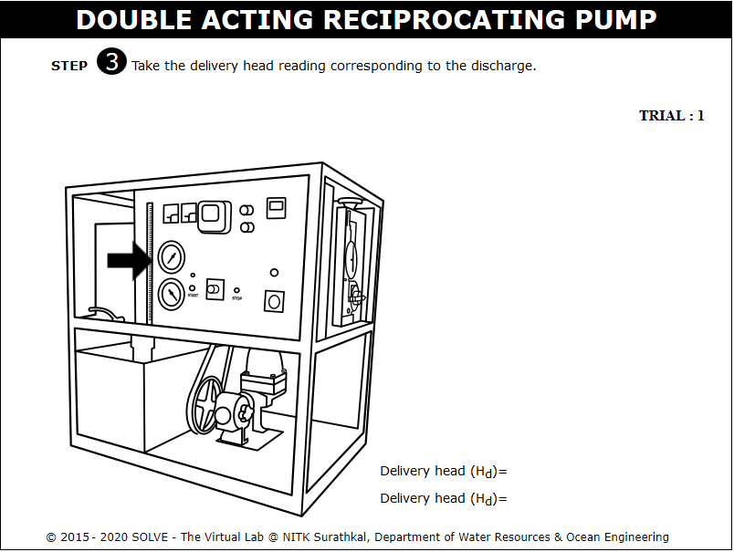 

6. Note the delivery head reading and click on NEXT button. 
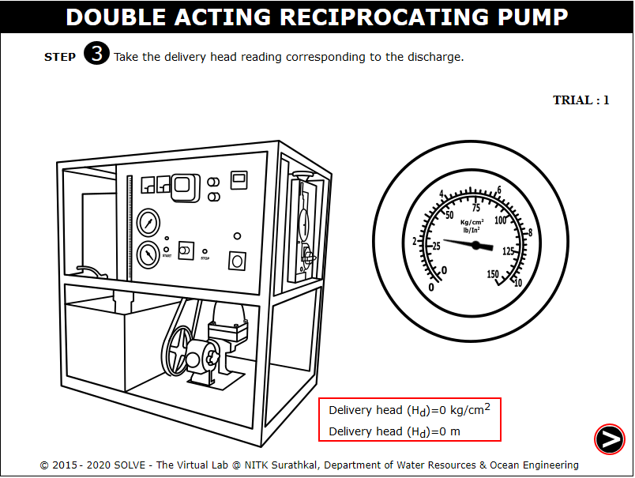 

7. Click on suction head gauge to show the suction head. 
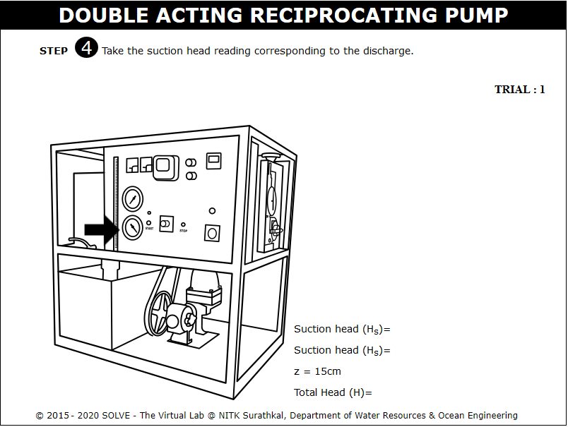 

8. Note the suction head reading and calculate the total head, click on NEXT button. 
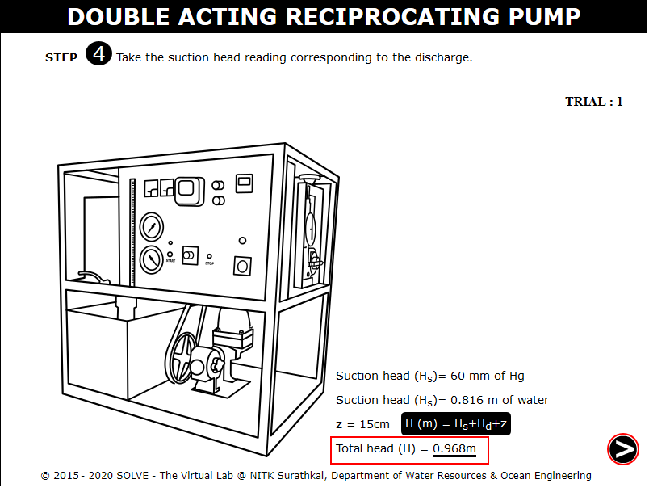 

9. Click on the hand wheel to get spring balance reading. 
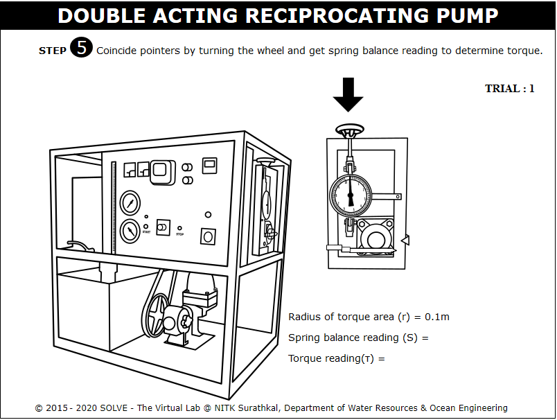 

10. Click on to calculate the Torque reading and click on NEXT button. 
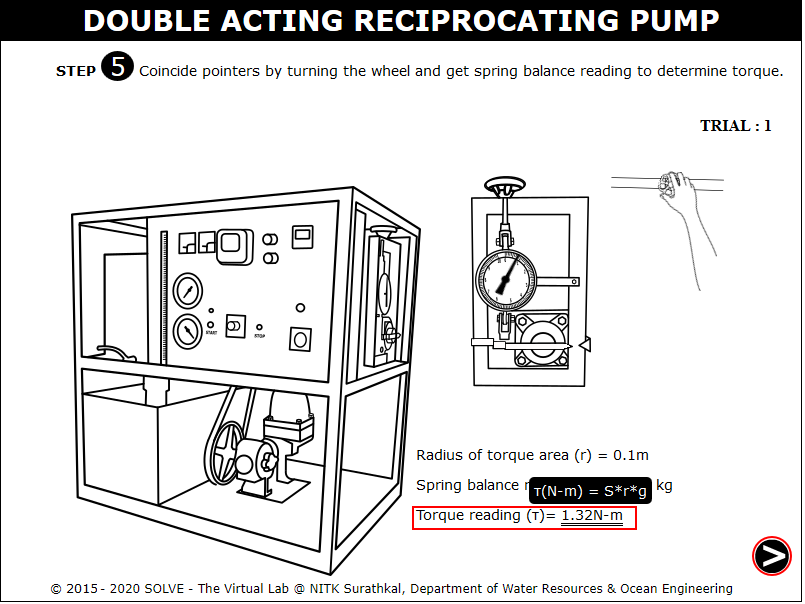 

11. Click on to close the stopper and note down the time required to fill 10cm. 
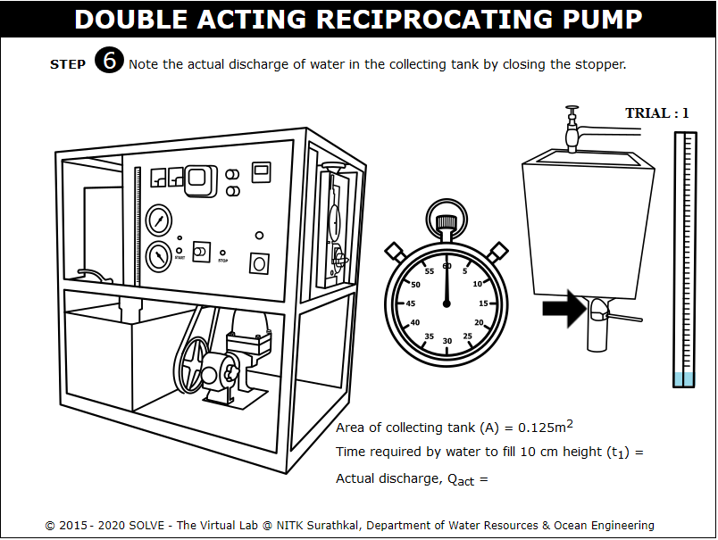 

12. Note down the time and calculate the actual discharge. 
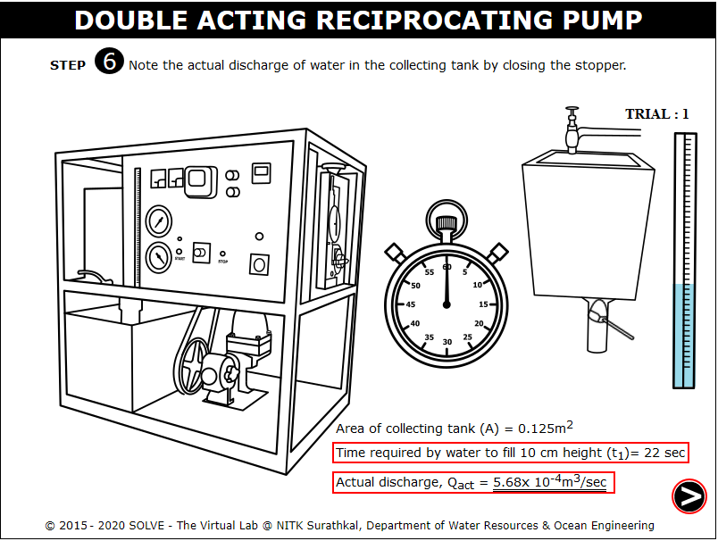 

13. Note the time taken by energy meter for 5 revolution, then click on NEXT button. 
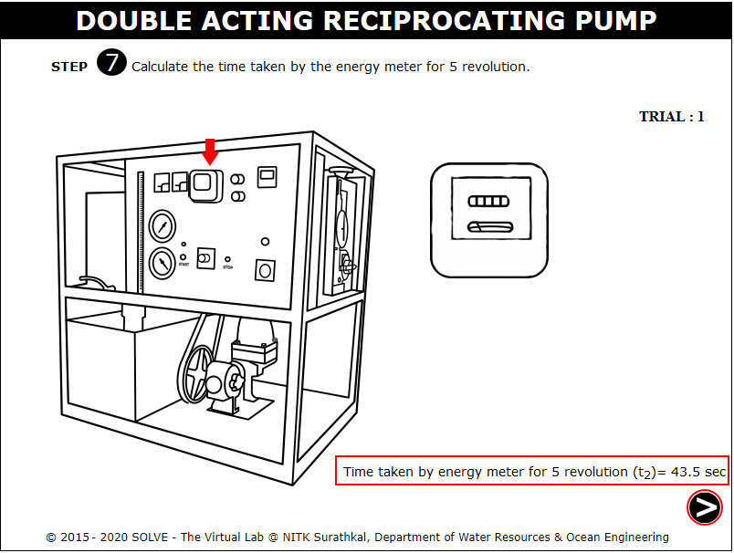 

14. Calculate the efficiency of motor and pump using the formula, then click on NEXT button to continue. 
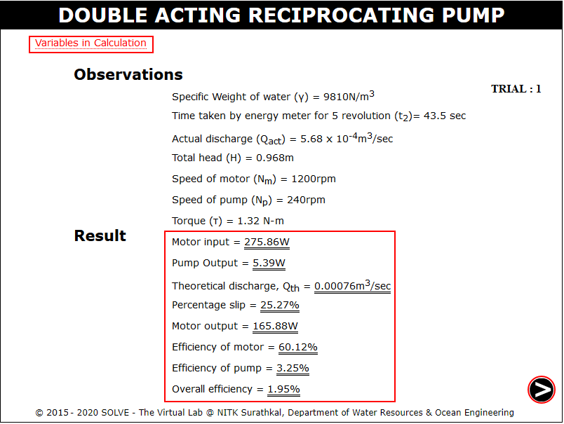 

15. Click on red button to stop the pump, then click on NEXT button. 
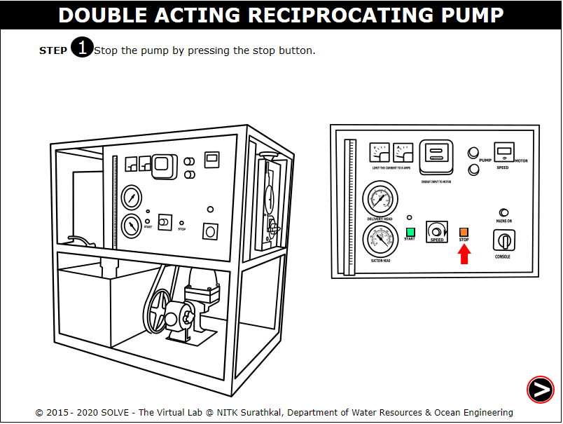 

16. Click on each label button to see the different graphs. 
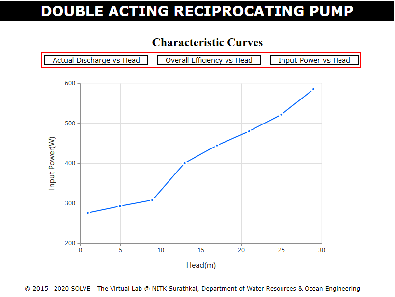 
