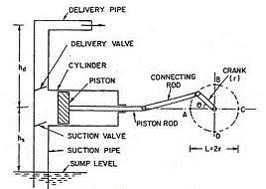
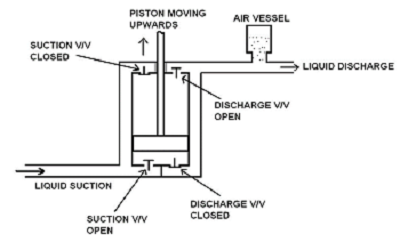
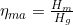
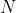

### INTRODUCTION 

The reciprocating pump is a positive displacement pump, it operates on the principle of actual displacement or pushing of liquid by a piston or plunger that executes a reciprocating motion in a closely fitted cylinder. The liquid is alternatively drawn from the pump and filled into suction side of the cyliner. The liquid fed to discharge side of the cylinder and emptied to the delivery pipe. There are three types of reciprocating pumps

1. Plunger pumps

2. Diaphragm pumps

3. Piston pumps

1. <strong>Plunger pumps</strong>: In this type of pumps, the cylinder is fitted with a plunger. This plunger creates the pressure on the water and discharges it through the discharge valve.

2. <strong>Diaphragm pumps</strong>: The plunger pressurizes hydraulic oil which is used to flex a diaphragm in the pumping cylinder. Diaphragm valves are used to pump hazardous and toxic fluids.

3. <strong>Piston pumps</strong>: In this type of reciprocating pump piston moves and pressurizes the fluid by using one or more reciprocating pistons. It is typically driven by an electric motor through crankshaft and connecting rod.

According to the contact between the plunger and water reciprocating pump is classified as single acting reciprocating pump and double acting reciprocating pump. A single acting pump is one which has one suction valve, delivery valve and one suction and delivery pipe. It sucks up the fluid in one direction only, when the crank turns clockwise from Inner Dead Centre(IDC) to Outer Dead Centre(ODC) the piston moves outward and in single stroke called suction stroke and delivery it in a single stroke called delivery stroke.

  

 

  

Sectional View of Double Acting Pump  
 

Source: (<a href="https://www.theengineerspost.com/reciprocating-pump/">https://www.theengineerspost.com/reciprocating-pump/</a>)

In double acting reciprocating pump suction and delivery strokes occur together. When the plunger moves forward, it makes the water to move out from the cylinder through the discharge valve at right side and the adjacent suction valve is closed in position. At this moment, the suction will be created inside the cylinder which draws the water into the cylinder through left side suction valve whereas the adjacent delivery valve is closed. During the reverse stroke, the water moves out from the cylinder through the delivery valve at left side, and the adjacent suction valve is closed in position.

It is positive displacement pump in which plunger or piston moves back and forth in a closely fitted cylinder, displaces a given volume of water for each stroke. The water is drawn from the pump and filled into the suction side of the cylinder. Due to the reciprocating action of piston or plunger the water is fed to discharge side and it is emptied to the delivery pipe.

  

Working of Double Acting Reciprocating Pump
 

<strong>Components of reciprocating pump</strong>:

  
1. <strong>Crank</strong>: It is a circular disc attached to the motor and used to transfer the rotation motion of the motor to the piston.

  
2. <strong>Connecting rod</strong>: It is a long solid rod. It provides connection between crank and the piston. It also converts the rotation motion of crank into the linear motion of the piston.

  
3. <strong>Piston</strong>: Piston is a solid cylinder like part of the pump which moves linearly in the hollow cylinder of the pump. Its motion is a main reason behind suction and delivery of the liquid.

  
4. <strong>Cylinder</strong>: This is a metal tube-shaped casing which is generally fitted with a metal lining called a 'cylinder liner '. The liner is replaceable when it becomes worn and inefficient. The cylinder is also fitted with suction and discharge ports which contain special spring loaded valves to allow liquid to flow in one direction only - similar to check valves.

  
5. <strong>Suction pipe</strong>: Pipe which takes liquid from the source and provides it to the cylinder of the pump is called suction pump.

  
6. <strong>Suction valve</strong>: It is one way valve placed between suction pipe and cylinder of the pump. It is open when suction takes place and close when delivery of the water is taking.

  
7. <strong>Delivery pipe</strong>: It is a pipe which takes water from the pump and provides it to the tank.

  
8. <strong>Delivery valve</strong>: It is oneway valve placed at the point of attachment of delivery pipe with cylinder. It is opened when delivery of the water is taking place and closed when suction of the water is taking place.

  
9. <strong>Strainer</strong>: It is a filter like part provided at the end of the suction pipe.Its main function is to solid particals from entering into the tank.

  
10. <strong>Air vessel</strong>: Air vessels are a closed container, in which the half part is filled with water & upper half part is filled with compressed air. These air vessels are installed very near to the suction valve & delivery valve to avoid the separation.

Working of Double Acting Piston Pump
 

Source: (<a href="http://ecoursesonline.iasri.res.in/mod/resource/view.php?id=3402">http://ecoursesonline.iasri.res.in/mod/resource/view.php?id=3402</a>)

<strong>Working of air vessel</strong>:

The top half contains compressed air and lower half contains fluid being pumped. Air and water are separated by a flexible diaphragm which is movable as per difference of pressure between two fluids. Air vessel is connected very near to the pump at nearly pump level. Without air vessel, frictional head increases and reaches a maximum value at mid stroke and decreases to zero. With air vessel, frictional head is constant throughout the stroke.

<strong>Purpose of Air vessel</strong>:

1. To obtain liquid at uniform discharge.

2. Due to air vessel frictional head and acceleration head decreases and the work overcoming friction resistance in suction and delivery pipe considerably decreases which results in good amount of work.

3. Reciprocating pump can run at high speed without flow separation.

4. Reduces the possibility of separation and cavitation.

5. Suction head can be increased by increasing the length of pipe below air vessel.

6. Large amount of power is saved due to low acceleration head.

<strong>Discharge- crank angle diagram for pump</strong>:

In single acting pump the liquid is intermittently fed into the discharge line, a double acting pump gives comparatively a more uniform discharge, because of the continuity of the suction and delivery strokes.

Single Acting Pump
 

Double Acting Pump
 

The reciprocating pump will always deliver the same volume of water for each stroke irrespective of discharge pressure. But, as the discharge pressure is increased, there may be internal leakage between the piston rings and the cylinder liner, or leaking internal valves, causing a decrease in the output. A measure of this is known as the 'Volumetric Efficiency' of the pump.

As the pressure inside the delivery pipe increases, the water flows into the air vessel. As the result, the air inside the air vessel gets compressed and the pressure gets reduced. Then, the water flows out from air vessel and makes the flow uniform. The peak pressure energy is thus stored in the air and returned to the system when pressure falls.

 
<strong>Comparision of Centrifugal and Reciprocating pump</strong>:

  Centrifugal pump |	Reciprocating pump
  :-------------:  | :-----------------:
  Steady flow |	Pulsating flow
  Uniform torque |	Torque is not uniform
  High efficiency for low head pumps high discharge |	Low efficiency for low head pumps
  Low initial cost |	High initial cost
  Low maintenance cost |	High maintenance cost
  Handles all type of fluids |	Causes trouble in handling viscous fluids
  Priming is needed |	Priming is not needed

Let,

= diameter of the cylinder,

= cross sectional area of the piston or cylinder,

= radius of crank,

=rpm of the crank,

= length of the stroke=2.

Then volume of water delivered in one revolution or discharge of water in one
revolution = Area × Length of stroke=

Number of revolution per second =

Discharge of the pump per second

=Discharge in one revolution× No of revolution per second

For double acting pump the cross sectional are of the piston rod is neglected.

Then the actual discharge is

Where, 

The difference between the theoretical and the actual discharge is called slip of the pump. This is the amount of water which leaks internally, if the pump is in good condition, the slip should be below 1.0%. If slip is above 5.0%, the pump needs to be overhauled. However, at operating pressures, the amount of slip is relatively constant as long as wear is not rapid. The output therefore can still be classed as constant.

If the actual discharge is more than the theoretical discharge, then the slip of the pump becomes negative. In that case the slip of the pump is known as negative slip. It occurs when delivery pipe is short suction pipe is long and pump is running at high speed.

%

%

 

Comparison of Performance Curves of Typical Centrifugal Reciprocating Pumps at Constant Speed 
 

Source: (<a href=" https://images.app.goo.gl/Q7P3P2EiPmvQqRB99"> https://images.app.goo.gl/Q7P3P2EiPmvQqRB99</a>)

<strong>Efficiencies of the pump</strong>:

1. <strong>Volumetric efficiency ()</strong>: Volumetric efficiency is the ratio of actual flow out of the pump to the flow out of the pump without any leakages.

2. <strong>Manometric efficiency ()</strong>: The actual manometric head developed by the pump Hm, is less than the theoretical head (Euler head) He representing the total hydraulic head loss in the flow through impeller. These losses include fluid frictional losses in the blade passage, circulatory flow between the blades due to finite number of blades.

The following are the equations used to determine the performance of the double acting reciprocating pump.

Torque,

Where = radius of brake drum

Actual Discharge,

Where 
 = area of piston of length , = speed of pump in rpm,  =length of stroke

 

 
 

 
Where 
=speed of motor in rpm

Where = No. of revolution of energy meter in  seconds

Where = specific weight of water, = discharge, = total head in m

 

 

 

